# 2022-Spring-SE-Config-Service

2022 年春季学期软件工程课程《客户端配置系统》项目配置获取服务后端，使用 Go 开发。本项目由字节跳动提供，详见[项目文档](https://bytedance.feishu.cn/docs/doccnfC6Mu2XVxaXL6MJNy6alFg)。

## 架构

配置获取服务分为三个独立的部分，分别对应 `cmd` 中的三个可执行文件：

- 配置服务：`configservice`
- 推送服务：`pushservice`
- 测试服务：`testservice`

另外，开发初期为了调试方便，独立部署了一个用于测试的代码执行后端 `playground`。

以上服务与项目其他部分的关系如下：

<!-- adjust for dark mode -->


## 技术选型

使用 Golang 开发。使用的主要框架有：

- HTTP 框架：[gin](https://github.com/gin-gonic/gin)
- ORM：[gorm](https://github.com/go-gorm/gorm)
- Python（Starlark）解释器：[starlark-go](https://github.com/google/starlark-go)
- JavaScript 解释器：[otto](https://github.com/robertkrimen/otto)
- WebSocket 服务器：[gorilla/websocket](https://github.com/gorilla/websocket)

其中，我们使用 starlark-go 执行 [Starlark](https://github.com/bazelbuild/starlark) 代码。Starlark 是一种 Python 方言，为计算配置而设计。与 Python 相比，Starlark 具有如下适合本项目的特点：

**可并行执行、效率高**。Starlark 解释器支持并发；而 Python 由于 GIL（全局解释器锁）机制，导致每个进程只能单线程运行 Python 解释器，无法实现并发。据用户代表介绍，他们使用 [go-python](https://github.com/sbinet/go-python) 库调用 CPython 接口，针对 GIL 的解决方案为：预先开启若干进程（从而能够并行运行多个解释器），通过进程间通信（如 socket）调用多个进程实现并发。Starlark 解释器可以内嵌在程序中实现并发，无需开销巨大的进程间通信，并且结合 Goroutine 能够实现开销极小的并发。

**安全执行任意代码**。Starlark 语言无法访问文件系统、网络、时钟等，并且通过语言特性保证解释器能够安全地执行不受信任的代码。这一点非常重要，因为平台的核心功能是执行代码，如果无法防范恶意代码，那么整个平台的正常运作就无法保障。在我们的实践中，使用 Python 解释器可能出现的问题，如高精度整数运算导致内存占用过高且无法中断，在 Starlark 解释器上不会出现。

**方便控制程序运行**。starlark-go 提供了易于调用的取消当前正在执行的任务的接口，使得我们可以很方便地完成超时中断等功能。CPython 没有提供类似的接口，对程序的控制需要在 Python 代码中完成。

## 系统实现

### 计算引擎

下面以 Starlark 计算引擎为例。JavaScript 引擎实现方法类似，但并没有实现代码缓存。

执行代码时，我们首先将用户的脚本定义为一个函数（从而支持 `return` 语句），并使用 Starlark 的 JSON Decoder 将客户端参数（以 `string` 传入计算代码）转换为字典 `p`，供程序使用：

```go
const runnerCode = `
def run(p):
    p = decode(p)
`
code = runnerCode+"\n    "+strings.Replace(code, "\n", "\n    ", -1)
```

我们使用 starlark-go 对代码进行解析，并将中间结果储存到一个共享变量中，作为缓存（缓存过期时间为 1 分钟）。如果缓存中存在未过期的解析结果，则直接使用，无需再次解析代码。[测试结果](#压力测试)表明，缓存能带来约 20% 的性能提升。

获取到代码解析结果后，我们调用之前定义的 `run` 函数，即可获得计算结果。

在其中有几个值得关注的技术细节：

**控制对缓存的并行访问**。由于缓存（`map`）是共享的，在多线程下同时写或删除缓存时可能会导致冲突，因此我们使用 `sync.RWMutex` 在访问时给缓存加上读或写锁，避免冲突。由于上锁会影响并发性能，因此应当尽量减少上锁操作，在持锁时尽快释放锁。

**超时中断**。为了防止恶意代码执行时间过长消耗计算资源，我们限制代码单次执行时间为 50ms。实现上，我们使用 `context.WithTimeout` 在超时时通过 `Context.Done` channel 触发相应的代码对正在执行的 Starlark thread 进行中断。为了避免 `Context.Done` 阻塞已完成的任务正常返回，我们将代码计算放在了一个新的 Goroutine 内，通过 channel 返回执行结果。

```go
select {
case <-ctx.Done():    // 超时中断
    thread.Cancel("") // 中断当前执行的程序
    res.Err = fmt.Errorf("execution timeout: %dms", timeout)
    return res
case res := <-ch:     // 正常返回结果
    return res
}
```

### 配置服务

配置服务接口的工作流程如下：

1. 从 Redis 缓存中获取配置；若配置项未缓存，则向 MySQL 查询，并缓存到 Redis 中
2. 检查配置是否生效
3. 若配置存在灰度发布版本，根据客户端的 `device_id` 判断是否满足灰度发布条件
4. 从 Redis 缓存中获取对应代码（正式/灰度）；若代码项未缓存，则向 MySQL 查询，并缓存到 Redis 中
5. 根据代码对应的规则判断当前设备是否符合获取配置的条件
6. 根据代码对应的参数定义判断客户端传输的参数是否正确
7. 调用计算引擎进行计算
8. 返回错误或配置内容

因为我们需要支持秒级更新，即在配置更新时将消息通知到客户端并由客户端拉取最新的配置，而 Redis 缓存需要一定时间才能过期，同时计算引擎可能存在代码解析的缓存，因此我们在客户端传递的参数中增加了一项 `cached`，当客户端意图获取最新的配置时，将其设为 `false`。此时我们直接从 MySQL 中获取最新的配置，并使计算引擎忽略缓存。

### 推送服务

推送服务实际上包括三个功能：

- 向管理平台提供接口，当配置更新时管理平台通过此接口通知推送服务
- 作为 WebSocket 服务器，向客户端推送配置更新的通知
- 为客户端提供报告配置错误的接口

为简单起见，向管理平台提供的接口使用 HTTP 实现。

其中，主动推送服务工作流程如下：

1. 验证连接者身份
2. 从 Redis 缓存中获取配置；若配置项未缓存，则向 MySQL 查询，并缓存到 Redis 中
3. 建立 WebSocket 连接
4. 当某个配置更新时，遍历所有订阅此配置的客户端，发送信息

使用 gorilla/websocket 实现 WebSocket 服务器比较容易，但是需要考虑一些细节问题。

**使用 channel 发送信息**。我们为每个连接分配一个 channel，当需要发送通知时，将通知内容发送到这个 channel 中，WebSocket 的工作循环内使用 `select` 获取内容并发送。

**判断连接状态**。由于我们并不能判断当前 WebSocket 连接是否正常，因此需要进行轮询并发送控制消息。我们使用 `time.Ticker`，每隔一定时间向客户端发送 ping 信息，如果发送失败或给定时间内未收到 pong 信息，则连接断开。

核心实现如下：

```go
loop:
for {
    select {
    case noti := <-c.ch: // 有新的更新信息
        err := conn.WriteJSON(noti)
        if err != nil {
            break loop
        }
    case <-ticker.C:     // 每隔一段时间
        deadline := time.Now().Add(pongInterval * time.Millisecond)
        err := conn.WriteControl(websocket.PingMessage, []byte{}, deadline)
        if err != nil {
            break loop
        }
    }
}
```

### 测试服务

测试服务和[配置服务](#配置服务)流程类似，有以下不同点：

- 需要在进行测试前验证请求者身份
- 需要对实际输出和期望输出进行对比，通过 `reflect.DeepEqual` 实现

## 压力测试

使用 [wrk](https://github.com/wg/wrk) 进行测试，测试条件如下：

- Intel(R) Core(TM) i5-9600KF CPU @ 3.70GHz, 6 Cores
- 只访问单个 64 行 Python 代码的配置

这里两个测试没有保持连接数相等，是一个失误，不过并不影响结果。

### Redis 缓存

开启代码缓存，4 线程 50 连接。

使用 Redis 缓存：

```
Running 10s test @ http://localhost:8000/config/80016513
  4 threads and 50 connections
  Thread Stats   Avg      Stdev     Max   +/- Stdev
    Latency     8.46ms    3.25ms  46.84ms   78.79%
    Req/Sec     1.44k   256.36     2.05k    67.75%
  57249 requests in 10.01s, 86.10MB read
Requests/sec:   5721.34
Transfer/sec:      8.60MB
```

不使用 Redis 缓存：

```
Running 10s test @ http://localhost:8000/config/80016513
  4 threads and 50 connections
  Thread Stats   Avg      Stdev     Max   +/- Stdev
    Latency    69.70ms   52.76ms 474.43ms   79.80%
    Req/Sec   189.24     43.07   363.00     69.50%
  7550 requests in 10.01s, 11.35MB read
Requests/sec:    753.88
Transfer/sec:      1.13MB
```

### 代码缓存

开启 Redis 缓存，4 线程 100 连接。

使用代码缓存：

```
Running 10s test @ http://localhost:8000/config/80016513
  4 threads and 100 connections
  Thread Stats   Avg      Stdev     Max   +/- Stdev
    Latency    16.36ms    6.34ms 143.93ms   87.45%
    Req/Sec     1.56k   271.10     2.25k    74.50%
  61937 requests in 10.01s, 93.12MB read
Requests/sec:   6189.84
Transfer/sec:      9.31MB
```

不使用代码缓存：

```
Running 10s test @ http://localhost:8000/config/80016513
  4 threads and 100 connections
  Thread Stats   Avg      Stdev     Max   +/- Stdev
    Latency    19.67ms    4.67ms  51.59ms   65.81%
    Req/Sec     1.28k   179.67     1.78k    72.75%
  50799 requests in 10.01s, 76.40MB read
Requests/sec:   5075.32
Transfer/sec:      7.63MB
```

在启用 Redis 和代码缓存的情况下，单一配置的获取 RPS 能达到 6k 左右。另外，Redis 缓存和代码缓存对性能的提升分别为 659% 和 22%。

## 致谢

学习和实现过程中参考了 [Co1lin/NSAOP](https://github.com/Co1lin/NSAOP)，在此表示感谢。
